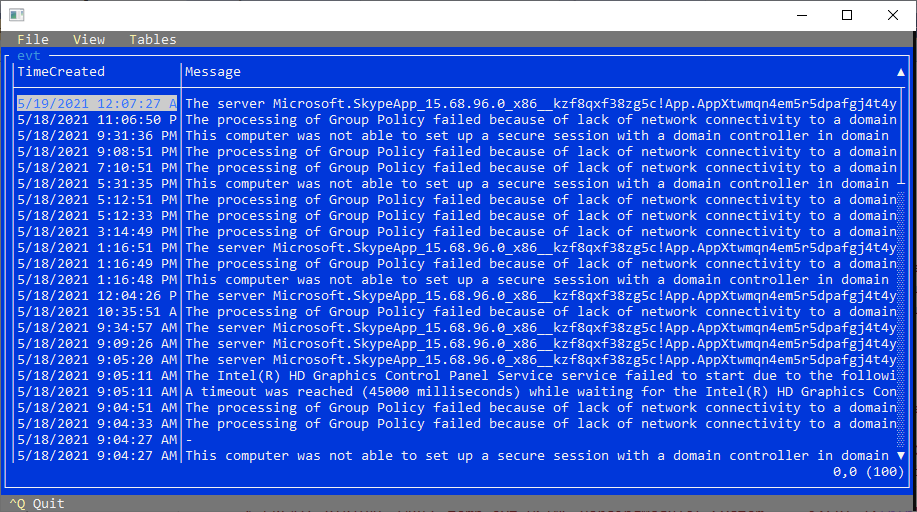

# Portable Log Parser

Portable log parser  is a command line tool for Microsoft Windows that will parse various system logs and use SQLite 
engine to query them. Output the results to the console, file, database, web service, etc. This repository is for documentation, plugins and samples. Developed by [Lizard Labs Software](http://www.lizard-labs.com)

## Available Input Formats

This is a list of available input format. Input format is set with ***-i=format*** switch. Each format can be configured with additional parameters. More information about configuration parameters can be found in the documentation.

- [Windows event log reader: -i=EVT](Documentation/evt_info.md)
- [Multiline text parser using regular expressions (also supports Grok syntax): -i=RegEx](Documentation/regex_info.md)
- [Comma-separated values: -i=CSV](Documentation/csv_info.md)
- [Tab-separated values: -i=TSV](Documentation/tsv_info.md)
- [W3C format reader (IIS, FTP, Apache, ISA, Exchange, SMTP, MediaSvc, etc.): -i=W3C](Documentation/w3c_info.md)
- [Text line input format: -i=TextLine](Documentation/textline_info.md)
- [Text word input format: -i=TextWord](Documentation/textword_info.md)
- [Dates table: -i=Delimiter](Documentation/delimiter_info.md)
- [Log4j/log4net XML Format: -i=log4jXML](Documentation/log4jxml_info.md)
- [JSON formated log: -i=JsonLog](Documentation/jsonlog_info.md)
- [Numbers table: -i=Numbers](Documentation/numbers_info.md)
- [Media files information: -i=Dates](Documentation/dates_info.md)
- [Delimiter-separated values: -i=MediaFiles](Documentation/mediafiles_info.md)
- [Custom plugin built with Microsoft .Net: -i=CustomPlugin](Documentation/customplugin_info.md)

***Your contributions are welcome!***

 

