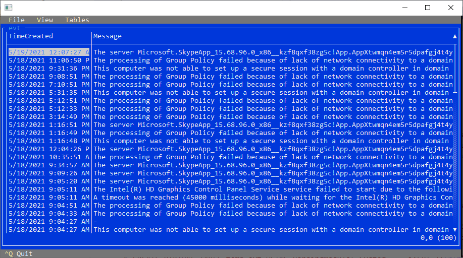

# Universal Log Parser with MCP AI

**Universal Log Parser with MCP AI** is a command-line tool for Microsoft Windows that parses various system logs and uses the SQLite engine to query them. You can output the results to the console, a file, a database, a web service, and more.

It also includes an **MCP server**, enabling AI-powered log parsing using SQL queries with standard SQLite syntax.

This repository contains documentation, plugins, and sample configurations. Developed by [Lizard Labs Software](http://www.lizard-labs.com).

> **Note:**  
> This project is currently in the testing and development phase. Universal Log Parser with MCP AI is not yet available to the general public. The final version will be released soon. Documentation and features described here may change before the official release.

## Main Features

- Command-line tool for querying various log files and structured text data using SQL.
- Supports multiple input formats:
  - Windows System Events
  - File system metadata
  - W3C logs (Apache and IIS)
  - log4net/log4j logs in XML or multi-line text
  - Field extraction with regular expressions and GROK patterns for parsing text files
  - Plain text files
  - CSV/TSV formatted files
  - Windows EVTX files via [Eric Zimmerman's EVTX parser](https://github.com/EricZimmerman/evtx)
  - Multi-line records
  - Key-value pairs
  - Custom plugins
- Interactive console menus for streamlined configuration and operation.
- Includes an **MCP server** enabling AI-powered parsing and integration with AI Agents, Copilot, and other automation tools.
- Built-in HTTP server to expose query results and data through REST API endpoints.
- Outputs results to various formats and destinations, including Text, TSV, CSV, HTML, JSON, XML, Markdown, and Excel.
- Reads files from the local file system or remote sources such as FTP, HTTP, and Amazon AWS S3.
- Processes data directly from compressed or encrypted archives (.gz, .zip).
- Delivers results to multiple targets, including the console, files, SQL Server databases, and text-based UIs.
- Extensible through a plugin programming interface.
- Versatile—can process not only log files but any structured or semi-structured data files.
- Portable—no installation required.
- Free for personal and professional use.

## Queries

The SQLite engine is used to query log data with standard SQL syntax.

### General Syntax of a ULP Query

This is the general syntax of a ULP query used to extract data from log files:

  > CREATE VIRTUAL TABLE temp.***vtablename*** USING ParsingModule('***from***', ***input format and parameters***); -- define data input  
  > SELECT * FROM ***vtablename***; -- execute the query

- **vtablename** is a unique name of the virtual table.
- **from** is a comma-separated list of files or event sources. Wildcards and glob patterns are supported (e.g., `'c:\logs\*.log, c:\logs\somelog.txt'`).
- **input format and parameters** define the parsing format and options that control how the input is processed.

Logs are imported through the [virtual table mechanism of SQLite](https://sqlite.org/vtab.html).  
The `ParsingModule`, built into Universal Log Parser, receives parameters specifying the log source (such as file paths with GLOB syntax) and input format properties describing how to process records and columns.  

Multiple virtual tables, using the same or different input formats, can be created within a single query. Detailed information about input format parameters is available in the ULP documentation.

After configuring the virtual table, the SQLite query language is used to retrieve and manipulate data. This includes extensive capabilities such as filtering, grouping, joins, set operations (`UNION`, `EXCEPT`, `INTERSECT`), window functions, and more. The SQLite engine is powerful and can execute complex queries efficiently.  

For more guidance on writing SQLite `SELECT` queries, refer to the [official SQLite documentation](https://sqlite.org/windowfunctions.html) or these [tutorials](https://www.sqlitetutorial.net/sqlite-select/).

### Sample Queries

Below are examples of ULP queries demonstrating how to configure virtual tables and execute queries against different data sources.

- **Read the last 100 events from the System event log:**

  > CREATE VIRTUAL TABLE evt USING ParsingModule('System', -i=EVT);  
  > SELECT * FROM evt LIMIT 100;

- **Count event types in the System event log:**

  > CREATE VIRTUAL TABLE evt USING ParsingModule('System', -i=EVT);  
  > SELECT EventType, EventTypeName, count(*)  
  > FROM evt  
  > GROUP BY EventType, EventTypeName;

    

- **Count the GET requests in an IIS W3C log:**

  > CREATE VIRTUAL TABLE w3c USING ParsingModule('c:\logfiles\u_ex2105*_x.log', -i=W3C);  
  > SELECT count(*) AS NoOfRequests  
  > FROM w3c  
  > WHERE [cs-method] = 'GET';

- **Querying different input types in a single session:**

  > CREATE VIRTUAL TABLE temp.textlineHuge USING ParsingModule('c:\txtfiles\*.txt', '-i=TextLine');  
  > CREATE VIRTUAL TABLE temp.w3c USING ParsingModule('c:\logfiles\u_ex2105*_x.log', -i=W3C);  
  >  
  > SELECT * FROM w3c  
  > ORDER BY [time] DESC  
  > LIMIT 1000; -- Retrieve the last 1000 requests from the W3C log  
  >  
  > SELECT * FROM textlineHuge  
  > WHERE Text LIKE '%results%'  
  > ORDER BY Text; -- Filter and sort lines containing 'results' from text files

### SQLite Engine

SQLite was chosen because it provides a powerful, proven, and widely adopted querying engine with excellent extensibility.  

Out of the box, ULP includes the following SQLite extensions:  

- `json1` — JSON support  
- `eval` — dynamic evaluation of SQL expressions  
- `crypt` — encryption functions  
- `compress` — compression utilities  
- `completion` — auto-completion support  
- `extension-functions` — additional math and string functions  
- `fts5` — full-text search  
- `percentile` — percentile calculations  
- `regexp` — regular expression matching  
- `series` — sequence generation  
- `totype` — data type conversions
- `ulp-specific` — custom SQL functions developed exclusively for Universal Log Parser  

Additional extensions may be included in future releases.  

For more information, refer to the [SQLite documentation](https://sqlite.org/docs.html).  
If you need specific extensions that could benefit your workflows, please contact us so we can evaluate adding them to the package.

## Universal Log Parser Command Line

Universal Log Parser is a command-line tool. The main executable, `ulogparser.exe`, is a standalone binary that can be used from the Windows command-line shell to execute queries and perform various operations.  

The binaries included in the package do not require installation. Once copied to a computer, ULP is ready to use immediately.  

Help mode, activated with the `-h` or `-?` switch, provides quick reference help topics displayed in the console. These topics can be further refined using additional arguments to view help for each supported input format.  

**Example command lines:**  

- **Run a query and output results to the console in vertical list format (default):**

  > ulogparser.exe "CREATE TABLE evt1 USING ParsingModule('Application,System,Security', -i=EVT); SELECT * FROM evt1 LIMIT 100;"

- **Use command-line shortcuts to execute the same query:**

  > ulogparser.exe -i=EVT -from="System" -limit=100

- **Read a query from a file and write results to a Markdown file:**

  > ulogparser.exe "c:\queries\query1.sql" -o="c:\reports\logoutput.md" -fmt=md

- **Use shortcuts to retrieve the last 100 error messages from the Windows System log and display them in a text-based user interface (TUI):**

  > ulogparser.exe -i=EVT -from="System" -select="TimeCreated, Message" -where="EventTypeName='Error'" -orderby="TimeCreated DESC" -limit=100 -o=tui

## Available Input Formats

The input format defines how data is parsed. It is specified using the `-i=format` switch. Each format supports additional configuration parameters. Refer to the documentation links below for details:

- [Windows Event Log Reader (`-i=EVT`)](/Documentation/evt_info.md)
- [Multiline Text Parser with Regular Expressions and Grok Syntax (`-i=RegEx`)](/Documentation/regex_info.md)
- [Comma-Separated Values (`-i=CSV`)](/Documentation/csv_info.md)
- [Tab-Separated Values (`-i=TSV`)](/Documentation/tsv_info.md)
- [W3C Format (IIS, FTP, Apache, ISA, Exchange, SMTP, MediaSvc, etc.) (`-i=W3C`)](/Documentation/w3c_info.md)
- [Text Line Input Format (`-i=TextLine`)](/Documentation/textline_info.md)
- [Text Word Input Format (`-i=TextWord`)](/Documentation/textword_info.md)
- [log4j/log4net XML Format (`-i=log4jXML`)](/Documentation/log4jxml_info.md)
- [JSON-Formatted Logs (`-i=JsonLog`)](/Documentation/jsonlog_info.md)
- [Numbers Table (`-i=Numbers`)](/Documentation/numbers_info.md)
- [Media File Metadata (`-i=MediaFiles`)](/Documentation/mediafiles_info.md)
- [Delimiter-Separated Values (`-i=Delimiter`)](/Documentation/delimiter_info.md)
- [Dates Table (`-i=Dates`)](/Documentation/dates_info.md)
- [Custom Plugins Built with .NET (`-i=CustomPlugin`)](/Documentation/customplugin_info.md)

## Available Output Types and Formats

ULP supports multiple output options for results, including text-based formats, files, and external systems:

- **Text-based output** to console, files, or network streams in formats such as:
  - Vertical lists
  - Tab-separated values (TSV)
  - Delimiter-separated fields (e.g., comma with or without quoting)
  - Markdown-formatted tables
  - JSON
  - XML
  - Custom plugins for user-defined formatting
- **Excel files**
- **TUI** (text-based user interface)
- **Microsoft SQL Server** databases
- **GUI** (graphical user interface) — planned for future releases
- **Web UI** — Web API and web-based application (planned for future releases)

## Extensibility (Plugins)

ULP can be extended with custom plugins developed in C# or VB.NET. Plugins can be created for:

- Custom input formats
- Custom text output formats (e.g., customized XML or JSON)
- Custom output targets (e.g., HTTP streams)
- Extension functions for use in SQL queries

Refer to the plugin development documentation for guidance on building and integrating plugins.

## Performance

On an average laptop (Intel i7, 16 GB RAM), ULP demonstrated the following performance benchmarks:

> CREATE VIRTUAL TABLE temp.w3cLarge USING ParsingModule('c:\logs\large.log', -i=W3C);  
> -- Large file (~200 MB), 471,651 log lines parsed as W3C  
>
> CREATE VIRTUAL TABLE temp.textlineHuge USING ParsingModule({fnameHuge}, '-i=TextLine');  
> -- Huge file (~10 GB), 20,752,820 log lines  
>
> SELECT * FROM w3cLarge ORDER BY [time] DESC;  
> -- Parsing and sorting completed in ~20 seconds  
>
> SELECT count(*) AS CntHuge FROM textlineHuge;  
> -- Parsing and counting completed in ~1 minute 17 seconds

Performance will vary based on hardware, storage speed, and input format complexity.

## Installation

If you prefer not to use an installer, a portable version is available.  

1. Download the ZIP archive: **UniversalLogParser.zip**.  
2. Extract the contents to any folder.  
3. Read the End User License Agreement (EULA) located in the `documentation` folder.  
4. If you accept the EULA, launch Universal Log Parser. If you do not accept the EULA, delete all files from the installation package.

## Microsoft Log Parser Replacement?

Microsoft Logparser 2.2 is a popular and versatile tool providing universal query access to text-based data such as log files, XML, and CSV, as well as Windows data sources like Event Logs and the Registry.  

Logparser remains widely used due to its flexibility and performance. We developed [Log Parser Lizard](https://lizard-labs.com/log_parser_lizard.aspx), a GUI for MS Logparser downloaded by hundreds of thousands of users worldwide. You can learn more about Logparser [here](https://docs.microsoft.com/en-us/sql/relational-databases/log-parser/log-parser-setup-and-architecture) and [here](https://en.wikipedia.org/wiki/Logparser).  

However, Microsoft has discontinued development. No new features have been added in years, and MS Logparser is a 32-bit application, which imposes limitations on modern platforms.  

To address these gaps, we built Universal Log Parser. While ULP is not fully compatible with MS Logparser, our goal is to implement as many equivalent features as possible. In many aspects, ULP already offers more modern capabilities. With community support, we hope ULP will be recognized as a solid replacement for Microsoft Logparser 2.2.

## Contributing

At this time, Universal Log Parser is free to use but not yet open source. We are actively developing the project and welcome all contributions and feedback. If you find this project valuable, please star or share the repository.

### How You Can Contribute

You can support and improve ULP in many ways:

- Show your interest in using the tool.
- Report issues.
- Suggest new features.
- Promote ULP and share it with others.
- Create and share sample queries and configurations to help new users.
- Send us sample log files so we can build parsers for them.
- Share your user stories describing how you use log parsing and what you need.
- Tell us which features you miss in other tools so we can consider adding them.
- Create tutorials and guides.
- Write blog posts or tweets about your experience with ULP.
- Explore our software offerings at [Lizard Labs Software](http://www.lizard-labs.com) — you may find additional tools useful.
- For a complete log parsing GUI experience, see [Log Parser Lizard](https://lizard-labs.com/log_parser_lizard.aspx).

We appreciate your interest in this project.

## Log Parsing with Desktop GUI

For an enhanced log parsing experience using SQL queries, try [Log Parser Lizard](https://lizard-labs.com/log_parser_lizard.aspx).  
Log Parser Lizard provides a powerful desktop GUI that can also manage and execute SQL Server queries across various log formats.  

If you wish to support the development of Universal Log Parser, consider purchasing an LPL license.  

### Future Plans

We plan to continue advancing our log parsing tools and ecosystem:  

- Develop new desktop and web-based GUI tools powered by the ULP engine.
- Expand support for additional input and output formats, functions, plugins, and sample configurations.
- Make Log Parser Lizard extensible so developers can build plugins for:
  - Custom input formats
  - SQL functions
  - Output formats
  - Output streams (e.g., integrations with custom Web APIs)

Currently, ULP is developed on Microsoft .NET Framework 4.x for Windows. We plan to migrate to .NET 5+ to support additional platforms.  

We welcome your feedback and ideas. Please share your thoughts with us at [office@lizard-labs.com](mailto:office@lizard-labs.com).  

***Your contributions are appreciated!***
